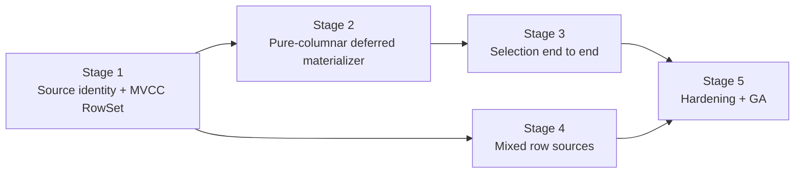

# Next-Generation Columnar Late Materialization: Implementation Overview

## Status

- Parent design:
  [Next-Generation Columnar Late Materialization](../2026-07-31-next-gen-columnar-late-materialization.md)
- Build scope: `ENABLE_NEXT_GEN_COLUMNAR`
- Query scope: TiDB configured with
  `cse.columnar-store-type = "columnar"`
- Initial semantic scope: `keep_order = false`
- Initial operator scope: Selection and projection-only scans
- Out of scope: TopN, Join, and a general-purpose materialization operator

This document is the index and dependency contract for the implementation
series. Each stage has an independently testable output and can be reviewed and
reverted without requiring later stages.

## Codebase findings that shape the implementation

The stage boundaries are based on the current implementation rather than only
on the target architecture.

1. `ColumnarTableReader` currently applies predicate rough-checking while
   constructing the handle/version readers and materializes every projected
   column in lockstep. The MVCC visibility pass therefore needs a new reader
   path; it cannot be implemented by wrapping the existing reader.
2. `ColumnarMergeReader` merges already materialized `Block`s and does not
   preserve physical source identity. A stable `SourceId` and deterministic
   tie-break priority must be introduced before a RowSet can be correct.
3. `collect_column_row_readers` collapses memtables and unconverted L0 files
   into a row merge reader. Its current iterator interface does not expose the
   winning physical source or source-local ordinal. Mixed row-source support is
   consequently a separate storage-engine stage and remains a GA blocker.
4. `CloudColumnarReaders` may read multiple physical tables on Rust workers and
   sends complete blocks over a one-way channel. The first staged
   implementation will use the sequential inner-reader mode. Existing
   Region/bucket and TiFlash pipeline parallelism remains available.
5. `RNColumnarSourceOp` delegates to `RNColumnarInputStream`. Placing the
   staged coordinator at this shared input boundary gives the BlockInputStream
   and Pipeline execution engines the same semantics without introducing a
   generic `MaterializeOp`.
6. A pushed Selection can be removed by TiDB after its expressions are copied
   into `TableScan.PushedDownFilterConditions`. There is then no stable
   Selection executor ID to receive runtime details. The first release records
   structured late-materialization stages in the TableScan
   `ColumnarScanContext`. Future TopN and Join designs may add operator-owned
   contexts.
7. The columnar-hub C header and its checked-in Rust interface mirror are both
   source files. No interface generation command is present in the repository,
   so every FFI change must update and validate both sides in the same commit.
8. The existing L2 pack-clean path is a valid and valuable alternative for
   projection-only scans. Path selection must happen before output and must not
   force visibility-first materialization when pack-clean is cheaper.

## Stage dependency graph



Stage 4 may be developed in parallel with the latter part of Stage 3 after the
Stage 1 contracts stabilize. It must merge before GA.

## Deliverables by stage

| Stage | User-visible behavior | Main repositories | Default state |
| --- | --- | --- | --- |
| [1](01-foundation.md) | None; storage contracts and differential tests only | cloud-storage-engine | Disabled |
| [2](02-pure-columnar.md) | Optional projection-only visibility-first scan for pure columnar snapshots | cloud-storage-engine, columnar-hub | Disabled |
| [3](03-selection-e2e.md) | Exact staged Selection with structured runtime details | tipb, cloud-storage-engine, columnar-hub, TiFlash, TiDB | Explicit setting/canary |
| [4](04-mixed-row-sources.md) | Same optimization with memtable and unconverted L0 sources | cloud-storage-engine, columnar-hub, TiFlash | Explicit setting/canary |
| [5](05-ga-hardening.md) | Production defaults, compatibility, observability, and rollback | all affected repositories | Policy-controlled |

## Cross-repository landing order

Changes that alter wire or FFI contracts must land in dependency order:

1. Add backward-compatible protobuf fields in `tipb` and regenerate language
   bindings.
2. Land storage behavior in `cloud-storage-engine`.
3. Bump the local cloud-storage-engine dependency and extend the
   columnar-hub C/Rust FFI.
4. Bump TiFlash submodules and add the C++ coordinator, settings, and runtime
   details.
5. Bump TiDB's tipb dependency and add runtime-details parsing and tests.
6. Add or enable cross-component full-stack tests.

Intermediate commits must compile with the feature disabled. A protobuf field
is optional, an FFI entry is appended rather than reordered, and a caller must
feature-detect the staged interface before using it.

## Stable contracts across all stages

### Snapshot and scan-unit ownership

- `SnapAccess` owns the immutable storage snapshot.
- One `SourceCatalog` is built for a snapshot/table scope and can be shared by
  bucket readers.
- Each Region or independent Region bucket owns its own RowSet.
- A RowSet never crosses snapshot, epoch, key-range, or bucket boundaries.
- A retry destroys the reader, catalog reference, RowSet, and outstanding
  batch tokens.

### Physical identity

`RowLocator = (SourceId, source-local physical ordinal)`.

The ordinal counts every physical version in that source, not only visible
rows. A source has a deterministic priority that is independent of pointer
addresses, task scheduling, and heap insertion order. Global MVCC ordering is:

```text
(handle ascending, version descending, stable source priority ascending)
```

### State and fallback

Path selection happens before any output:

```text
Created
  -> PreparingVisibility
  -> ReadingEarlyColumns
  -> ReadingDeferredColumns
  -> Drained
```

Any invalid transition, token reuse, mask-length mismatch, replay mismatch, or
storage error moves the reader to `Failed`. The reader does not silently switch
to eager mode after emitting rows.

### Correctness baseline

Every stage uses the current eager path as the differential oracle:

- compare output as a multiset because `keep_order = false`;
- compare SQL values, physical table IDs, and error behavior;
- cover int handles, common handles, deletes, overlapping versions, empty
  filters, all-pass filters, and all-reject filters;
- make snapshot, range, and schema identical for both readers.

### Memory

Before beginning a staged read, estimate:

```text
SourceCatalog
+ MVCC RowSet
+ candidate/final RowSets
+ source cursors
+ early blocks and filter columns
+ deferred output blocks
+ owned row values for the current row-source batch
```

If the estimate exceeds the configured RowSet budget, choose eager mode before
output. Normal query memory tracking remains authoritative after the estimate.

### Documentation

New public Rust types, C ABI structs/functions, C++ coordinator APIs, protobuf
messages, settings, and runtime-detail fields require doc comments that state:

- ownership and lifetime;
- ordinal and bitmap semantics;
- allowed state transitions;
- cancellation and error behavior;
- backward-compatibility behavior for absent fields.

Any new storage invariant must also update
`contrib/cloud-storage-engine/MAINTAINER_GUIDE.md`.

## Feature controls

The implementation adds these TiFlash profile settings in
`dbms/src/Interpreters/Settings.h`:

```text
columnar_enable_late_materialization = false
columnar_enable_visibility_first_without_filter = false
columnar_late_materialization_max_rowset_bytes
columnar_late_materialization_row_batch_rows
columnar_late_materialization_row_batch_bytes
```

Settings are captured when a reader is created. Changing a setting affects new
readers only. The existing `dt_enable_bitmap_filter` remains a prerequisite for
executing pushed filters through the bitmap/filter path; it is not replaced by
the new settings.

The effective state also requires:

```text
ENABLE_NEXT_GEN_COLUMNAR
flash.use_columnar
cse.columnar-store-type = "columnar"
```

## Decisions deferred beyond this series

- Adaptive dense/sparse bitmap representation. Start with a dense,
  source-local mask and introduce adaptation only with benchmark evidence.
- Rust inner physical-table concurrency for staged batches. Re-enable only
  after defining a bidirectional scheduling protocol and proving a benefit over
  existing bucket/pipeline parallelism.
- TopN scatter-position semantics and Join paired-locator/multiplicity
  semantics. They require separate operator designs.
- A generic pipeline `MaterializeOp`. The Selection implementation uses the
  shared RN input coordinator.
